# Pijarcamp Products Web
Website untuk CRUD (Create, Read, Update dan Delete Produk dan Barang)

## Gambaran Umum Website Saya

Data umum :

Bahasa Back-End yang digunakan adalah PHP dan Database yang digunakan adalah MySQL, jika diperlukan saya telah menyiapkan databasenya dengan file bernama "pijarcamp.sql" pada repository github saya.

Host :”localhost”
User :”root”
Password: (kosong)
Database: “pijarcamp”
Tabel: “produk”

- Halaman awal ketika database masih kosong

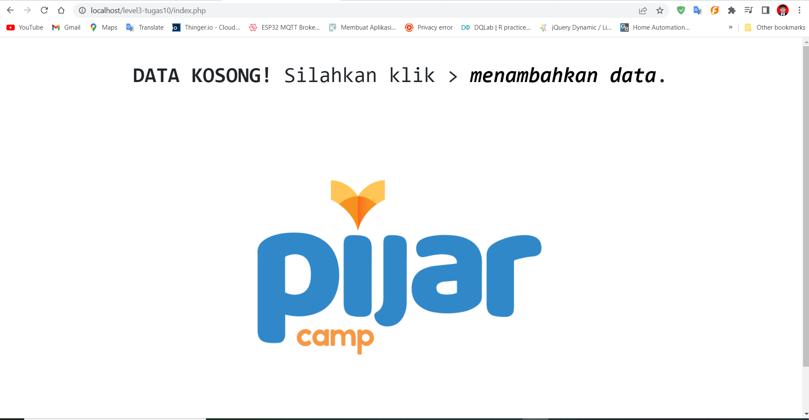

- Tambah Data

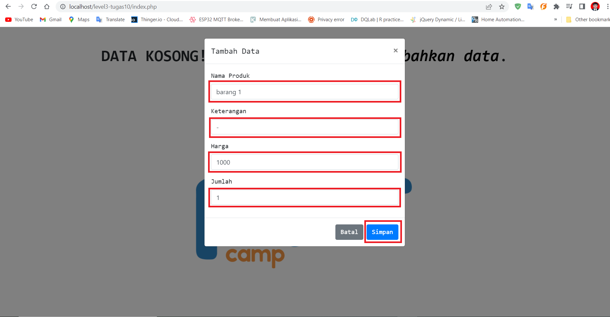

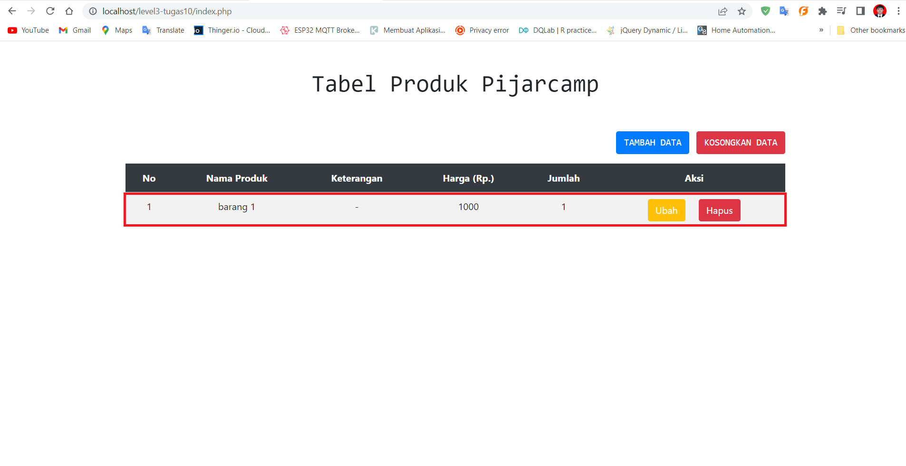

- Navigasi Halaman (Paginasi)

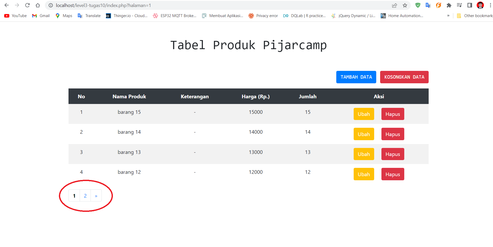

- Edit Data

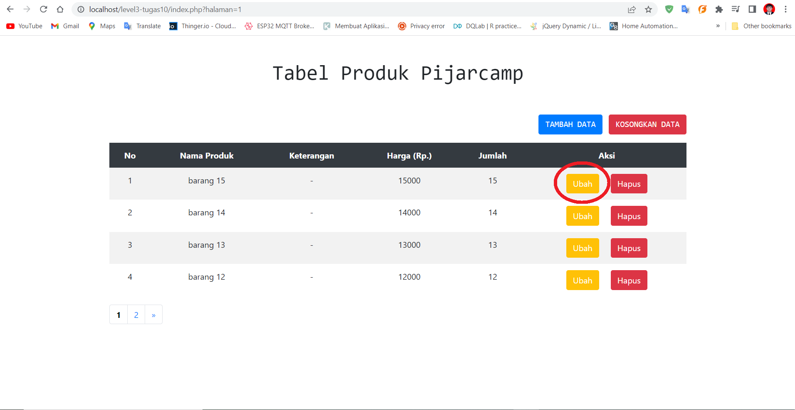

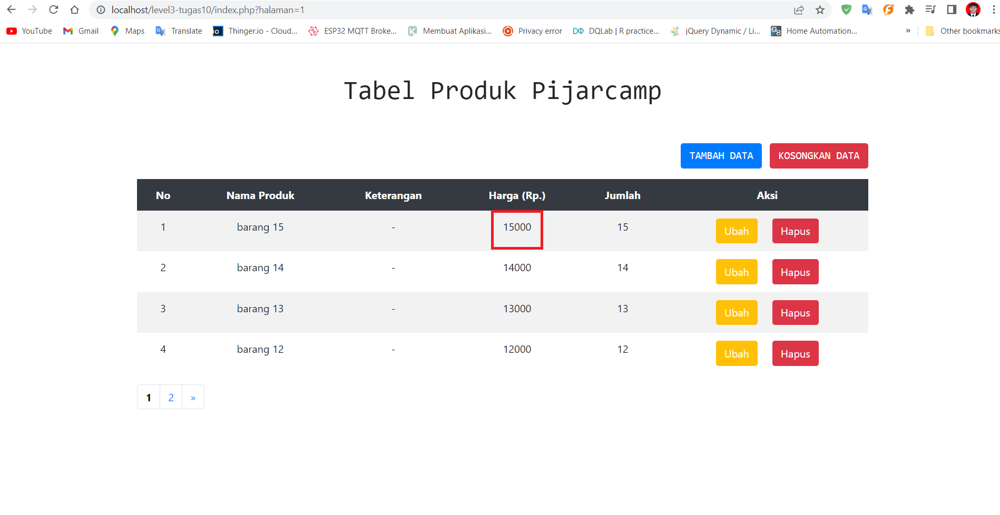

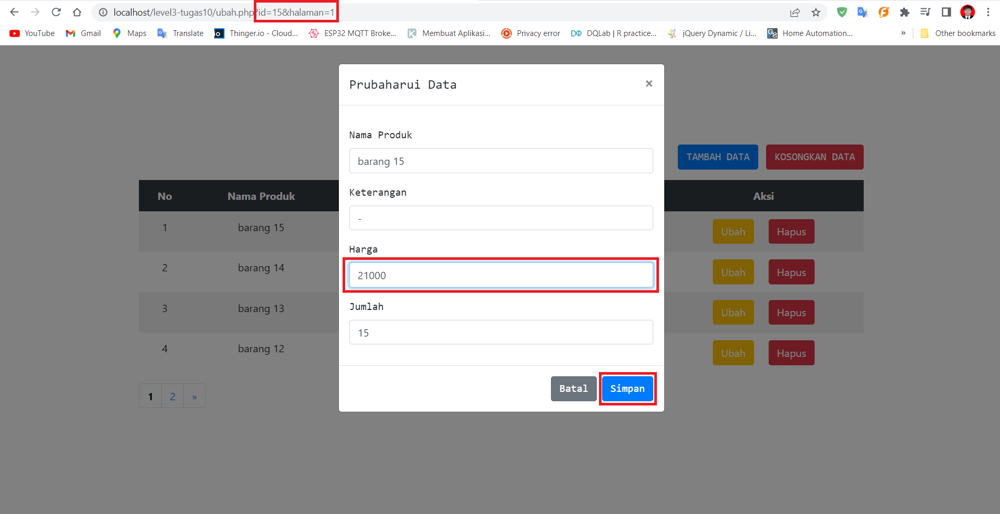

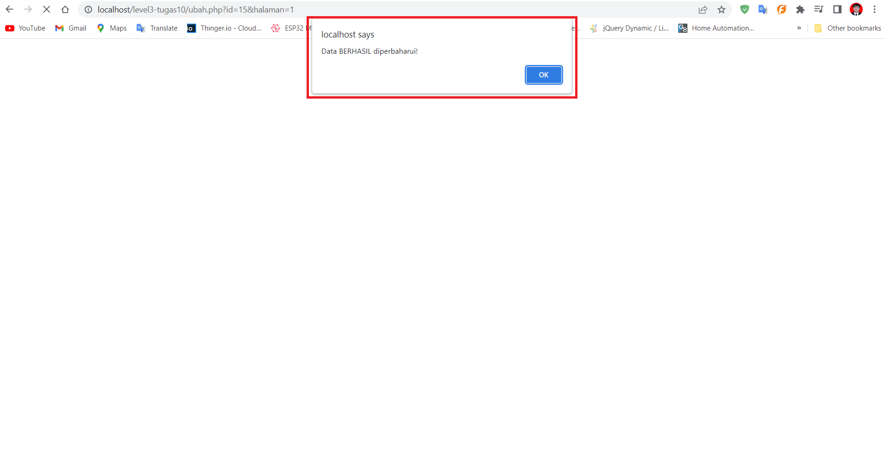

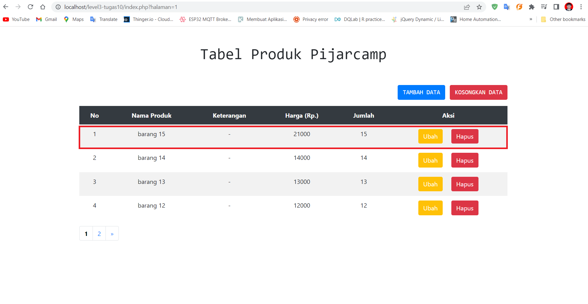

- Hapus Data

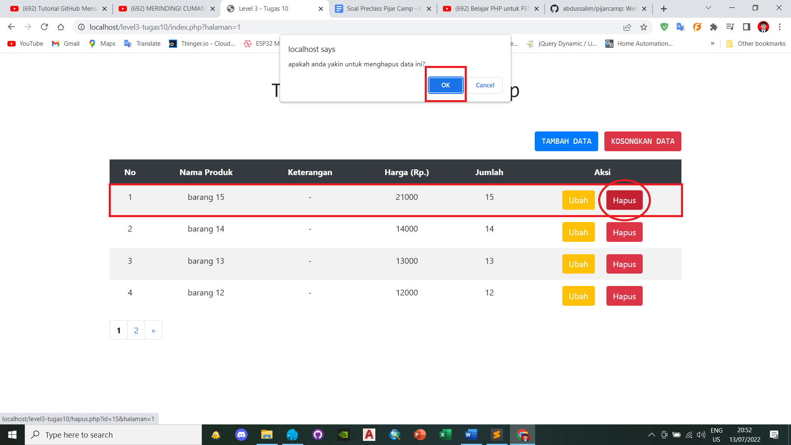

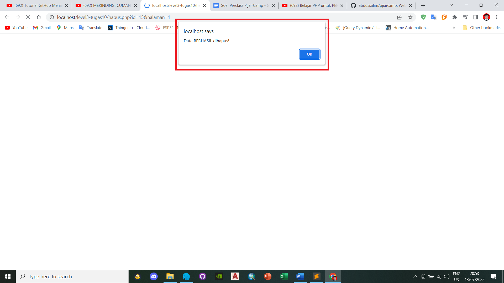

- Kosongkan Tabel

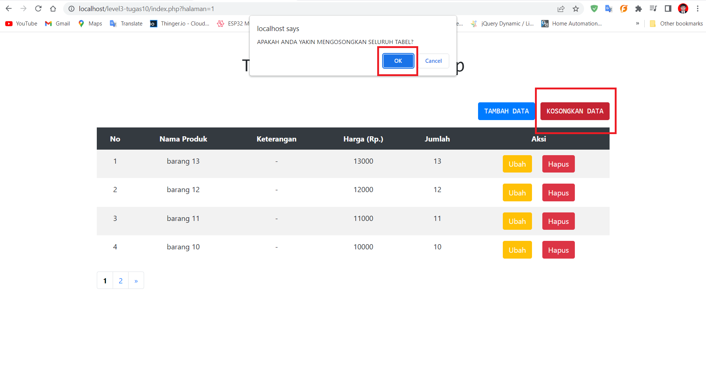

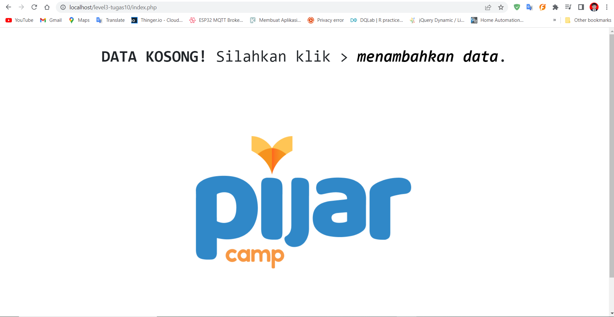

Demikian gambaran umum daripada website sederhana saya, semoga dapat dimengerti terimakasih. ^^

copyright of https://abdussalim.github.io
